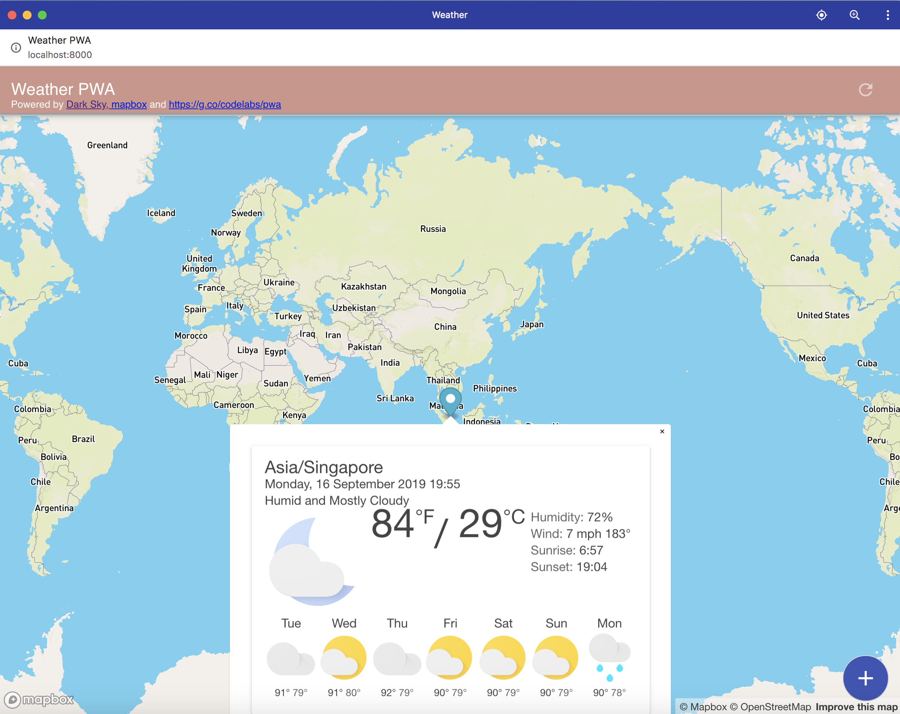

# Progressive Web Application

This is a simple weather application to show 7 day weather forecast for any location on the map.

# Third party Dependencies
- [Dark Sky API](https://darksky.net/about) For weather forecast api
- [Mapbox](https://www.mapbox.com/about/) For maps

# How to run
Get you darksky and mapbox API Keys and add it at relevant places.
To install node dependencies
```
$npm install
```
To run the server on localhost:8000
```
$node server.js
```

# Acknowledgements
- [Google Codelab](https://developers.google.com/web/fundamentals/codelabs/your-first-pwapp/)
- [Udacity 811 - Intro to Progressive Web App](https://classroom.udacity.com/courses/ud811)

# What to expect

[](./pwa_app.png)

